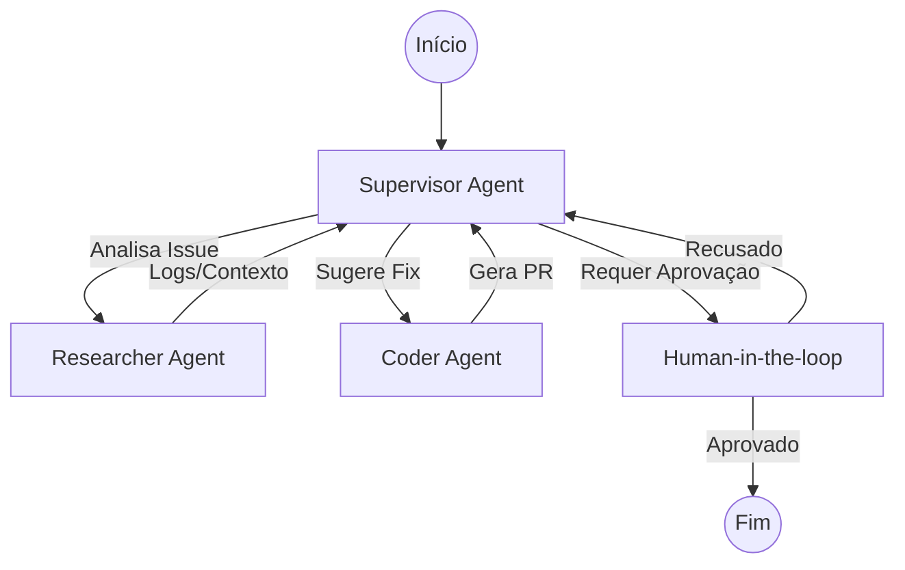

# Orquestração do Triage Panda (Fluxo de Agentes)

O **Triage Panda** utiliza uma arquitetura multi-agente orquestrada via **LangGraph.js**, focada em automatizar a triagem e correção de bugs a partir de webhooks do GitHub.

## 1. Grafo de Decisão (Padrão Supervisor)

O sistema segue o padrão **Supervisor**, onde um agente central (LLM) decide qual especialista deve agir em cada etapa do ciclo de vida do bug.

## 2. Especialistas (Trabalhadores)

- **Researcher:** Analisa o log de erro, identifica o arquivo culpado e mapeia o contexto técnico.
- **Coder:** Recebe o contexto e propõe a alteração de código, criando um Pull Request.
- **Supervisor:** Mantém o estado global e garante que a tarefa seja concluída ou que um humano seja notificado se necessário.

## 3. Estado Global (AgentState)

O estado é persistido entre os passos e contém:
- `messages`: O histórico de conversas entre os agentes.
- `next`: O próximo passo a ser executado.
- `context`: Metadados do repositório, IDs de issues e resultados de análise técnica.

## 4. Human-in-the-loop (HITL)

Para garantir segurança sênior, nenhuma alteração de código é fundida (merged) sem passar pelo nó de interrupção, onde um humano deve validar a proposta da IA.
